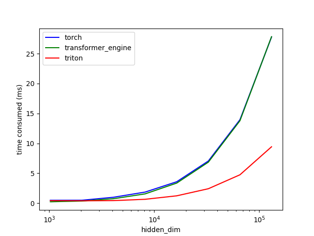

# triton_study


## FW function
- Rotate function is implemented with re-indexing of the memory:

```
offset_from_middle = block_start + (BLOCK_SIZE//2 + tl.arange(0, BLOCK_SIZE)) % BLOCK_SIZE
# We can expect the cache hit since we already accessed the same address
x_rot = tl.load(x_ptr + offset_from_middle, mask=mask)
x_rot = tl.where(tl.arange(0, BLOCK_SIZE) < BLOCK_SIZE//2, -x_rot, x_rot)
```
It doesn't have to re-shape + concatenate the tensor which was there in rotate_fn in the original ROPE implementation.


## BW function
- The gradient of x can be computed as follows:

```
grad_x = grad_y * cos(freq) - rotate(grad_y * sin(freq))
```

The same logic is applied here, to get the rotated grad_y and rotated freq as follows:

```
offset_from_middle = block_start + (BLOCK_SIZE//2 + tl.arange(0, BLOCK_SIZE)) % BLOCK_SIZE
mask = offset_from_middle < n_elements
rot_freq = tl.load(freq_ptr + offset_from_middle, mask=mask)
_rot_grad_y = tl.load(grad_y_ptr + offset_from_middle, mask=mask)
rot_grad_y = tl.where(tl.arange(0, BLOCK_SIZE) < BLOCK_SIZE//2, _rot_grad_y, -_rot_grad_y)

```

## Performance
- Measure time consumption for the forward and backward computation of rope (lower is better)


```
# to reproduce
python rope.py
```
